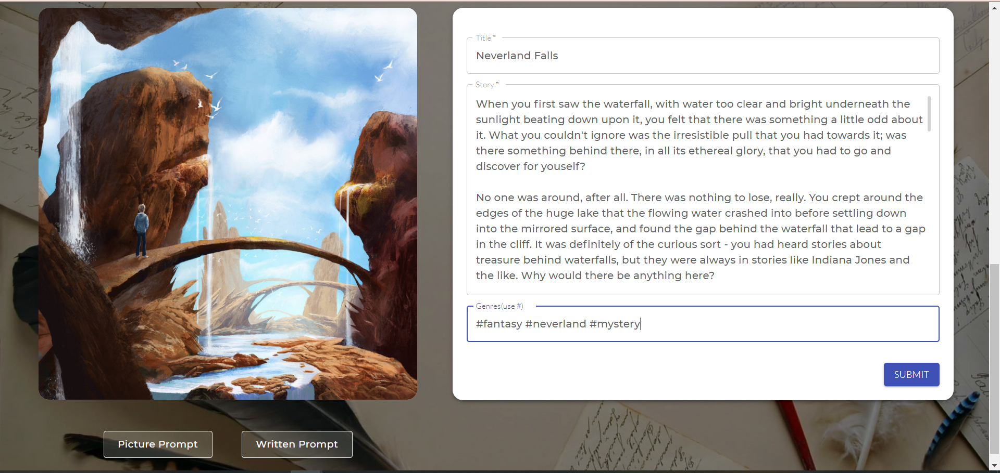
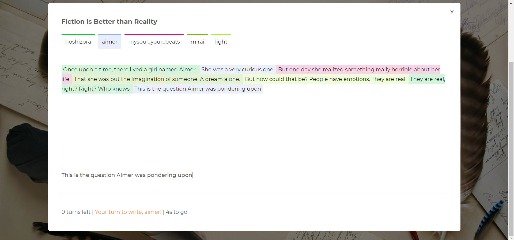

<!-- ABOUT THE PROJECT -->
## About The Project

Writing, like all creative pursuits, takes time, efforts and of course, creativity. My web app aims to improve that creativity. 
Here are the features that helps you stretch your creative capacities:
* Random Prompt Generator : A user can generate a random prompt, served in two styles - Picture Prompt (through DeviantArt API) and Writing Prompt (Reddit API). After taking the prompt, one can then publish their piece as posts.

* Drafts : User can write any idea or random thoughts in short so as to memo them for later reference. These can be stored in drafts (and can be edited/created, deleted whenever the user wishes to)

* Collaborative Story Writing : One can create channels or rooms, start a timer, and then write stories in a collaborative fashion. Each writer gets 20s of time to write their prose per turn, and there are total 7 turns per one round. Each writer in the room can see in real time, 
  whatever the current writer is writing (color coded), but cannot edit it (for obvious reasons). Motive behind this feature is that weaving a story together can help the writer to be able to think of ideas on the go, and have the ability to make a logical story even
  if the previous prose has been written by some other writer. The admin writer may publish the piece.

<!-- USAGE EXAMPLES -->
## Usage Examples
* Prompt Generator

* Collaborative Writing

## Technologies

This is a MERN stack web app. These are the technologies used :-
* Socket.io (for client side and server side)
* Node js (Express)
* MongoDb (Mongoose)
* React JS + Material UI
* Context API
* JWT Authentication

## API

* [DeviantArt API](https://www.deviantart.com/developers/) (for picture prompts)
* [Reddit API](https://www.reddit.com/dev/api/) (for written prompts)

